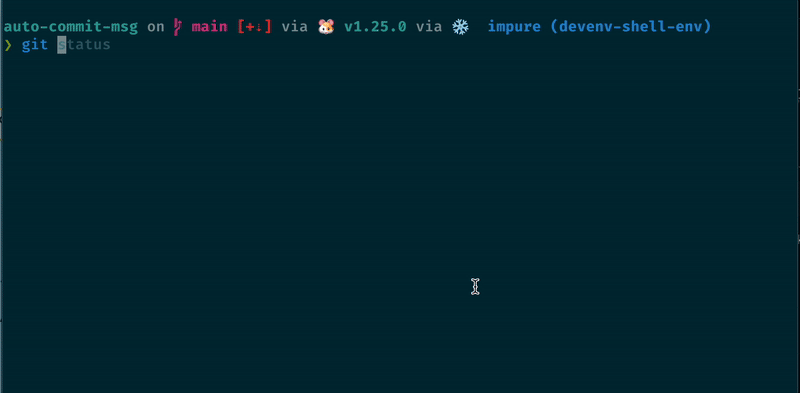

# autocommitmsg

[](https://github.com/sestrella/autocommitmsg/actions/workflows/build.yml)
[](https://github.com/sestrella/autocommitmsg/actions/workflows/release.yml)

Generates a commit message from a `git diff` using AI.

**Features**

- Supports OpenAI-like providers.
- Switch model based on the diff.



The commit messages for this project were generated using this tool.

## Installation

### devenv users

Add the `autocommitmsg` input to the `devenv.yaml` file:

```yml
inputs:
  autocommitmsg:
    url: github:sestrella/autocommitmsg
    overlays: [default]
  nixpkgs:
    url: github:cachix/devenv-nixpkgs/rolling
```

Add the `autocommitmsg` hook to the `devenv.nix` file as follows:

```nix
{ pkgs, lib, ... }:

{
  dotenv.enable = true;

  git-hooks.hooks.autocommitmsg = {
    enable = true;
    entry = lib.getExe pkgs.autocommitmsg;
    stages = [ "prepare-commit-msg" ];
  };

  cachix.pull = [ "sestrella" ];
}
```

**Note:** Enabling `dotenv` is optional if the `OPENAI_API_KEY` environment
variable is available.

## Configuration

`autocommitmsg` can be configured via a `.autocommitmsg.yaml` file in
the project's root directory or the user's home directory. The available
configuration parameters are:

- **`base-url`**: The base URL of the OpenAI-like provider.
  - **Default**: `https://generativelanguage.googleapis.com/v1beta/openai`
- **`api-key`**: The name of the environment variable that contains the API key.
  - **Default**: `GEMINI_API_KEY`
- **`short-model`**: The model to use for diffs with fewer lines than `diff-threshold`.
  - **Default**: `gemini-2.5-flash-lite`
- **`long-model`**: The model to use for diffs with more lines than `diff-threshold`.
  - **Default**: `gemini-2.5-flash`
- **`diff-threshold`**: The line count threshold to switch between `short-model` and `long-model`.
  - **Default**: `500`

Here is an example `.autocommitmsg.yaml` file:

```yaml
base-url: "https://api.openai.com/v1"
api-key: "OPENAI_API_KEY"
short-model: "o4-mini"
long-model: "gpt-4.1"
diff-threshold: 250
```

## Usage

After setting `autocommitmsg` as a [prepare-commit-msg] hook, invoking `git
commit` without a commit message generates a commit message. If a commit message
is given, `autocommitmsg` does not generate a commit message and instead uses
the one provided by the user.

## License

[MIT](LICENSE)

[prepare-commit-msg]: https://git-scm.com/docs/githooks#_prepare_commit_msg
